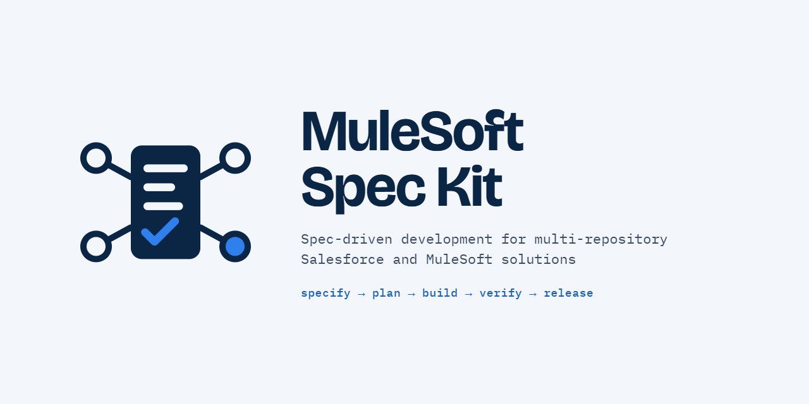
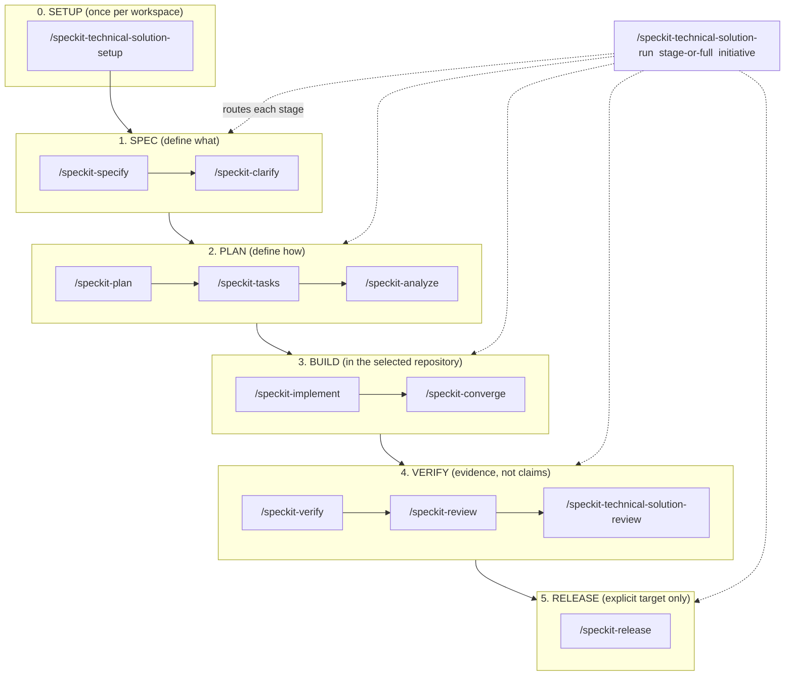
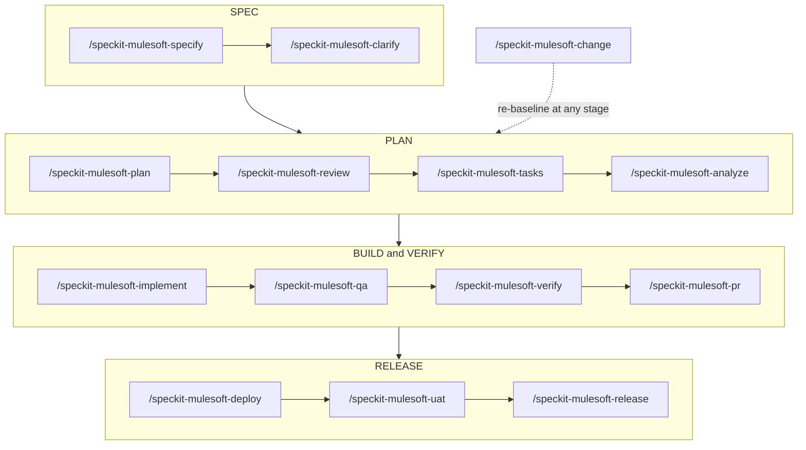
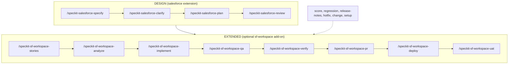
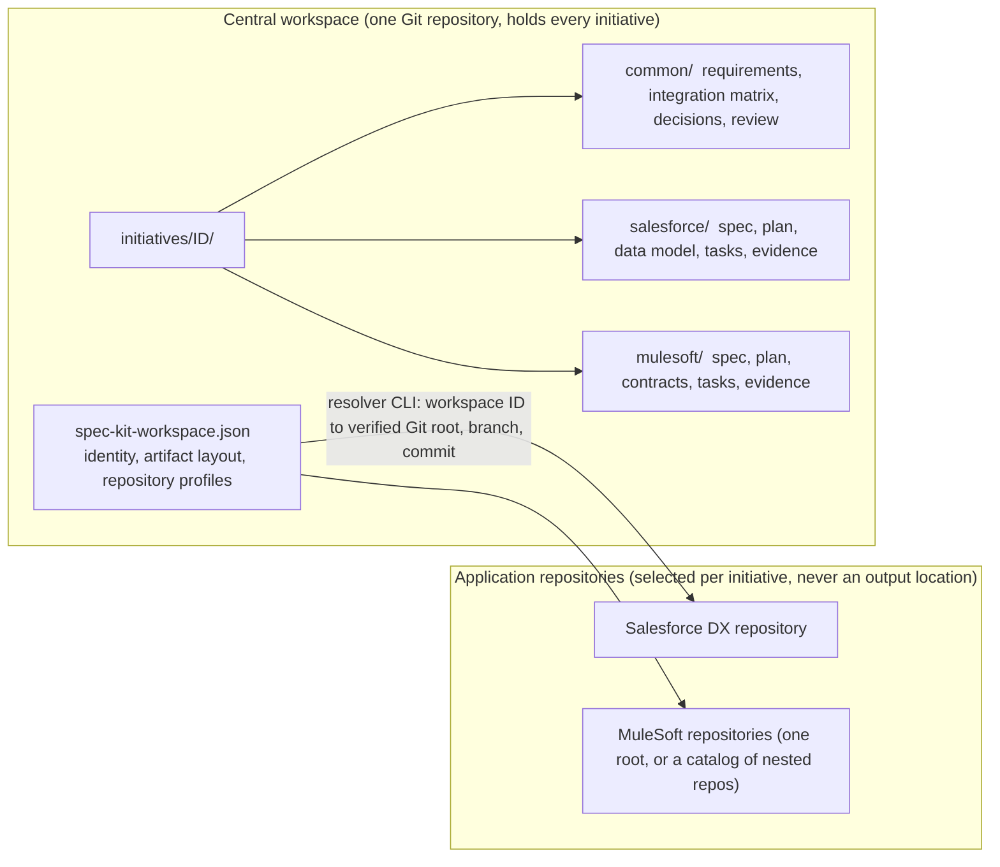

<div align="center">



**Spec-Driven Development for multi-repository Salesforce and MuleSoft solutions, built on [GitHub Spec Kit](https://github.com/github/spec-kit).**

</div>

MuleSoft Spec Kit turns Spec Kit into a *central workspace*: one repository that holds the specifications, plans, tasks and evidence of every initiative, while the application code stays in the repositories it belongs to. It ships as ordinary Spec Kit building blocks (extensions, a preset, a workflow and a bundle), so it installs with the `specify` CLI into any project that will serve as a central workspace, and it assumes nothing about your organisation, repositories, orgs or runtimes.

## What you get

| Building block | What it gives you |
| --- | --- |
| [`extensions/technical-solution`](extensions/technical-solution/) | The workspace itself: `/speckit-technical-solution-setup`, `-run` and `-review`, the shared templates, the workspace seed files and the resolver that locates application repositories. |
| [`extensions/mulesoft`](extensions/mulesoft/) | Fourteen MuleSoft stages, from requirements and API contracts to QA, deployment and release, for any Mule 4 / Anypoint repository. |
| [`extensions/salesforce`](extensions/salesforce/) | Four Salesforce design stages with a read-only DX MCP gate, for any Salesforce DX repository. |
| [`extensions/sf-workspace`](extensions/sf-workspace/) | Opt-in add-on: the fourteen extended [SFSpeckit](https://github.com/ysumanth06/spec-kit-sf) stages (stories through UAT, vendored, MIT) adapted to the central workspace, on top of the `salesforce` design stages. |
| [`presets/central-workspace`](presets/central-workspace/) | The core `speckit` commands and templates redirected to `initiatives/<id>/<domain>/`. |
| [`workflows/technical-solution`](workflows/technical-solution/) | A resumable pipeline that runs a stage or the whole cycle and stops at a review gate. |
| [`bundles/central-workspace`](bundles/central-workspace/) | All of the above as one installable set. |

## Lifecycle at a glance

One orchestrator drives every initiative; each stage is also a command you can call on its own.



The MuleSoft stages, for any Mule 4 / Anypoint repository (artifacts under `initiatives/<id>/mulesoft/`):



The Salesforce stages: design with the `salesforce` extension, then optionally the extended SFSpeckit stages of the `sf-workspace` add-on (artifacts under `initiatives/<id>/salesforce/`):



## Get started

1. Install the Spec Kit CLI: `uv tool install specify-cli --from git+https://github.com/github/spec-kit.git` (see the [Spec Kit installation guide](https://github.com/github/spec-kit/blob/main/docs/installation.md)).
2. Create a workspace from this checkout:

   ```bash
   git clone https://github.com/ValerioJiang/mulesoft-spec-kit.git mulesoft-spec-kit
   mulesoft-spec-kit/scripts/bash/create-workspace.sh ../my-workspace --integration claude
   ```

   The script runs `specify init` with the `central-workspace` preset and the `technical-solution`, `mulesoft` and `salesforce` extensions, installs the workflow, verifies every component and seeds `.gitignore`. Add `--with-sf-workspace` for the extended Salesforce add-on and `--update` to refresh an existing workspace after a toolkit update; a PowerShell twin is in `scripts/powershell/`. The equivalent manual commands are in the [quickstart](docs/quickstart.md).
3. Open your coding agent in `my-workspace` and run `/speckit-technical-solution-setup`. It creates `spec-kit-workspace.json`, `initiatives/` and `.specify/profiles/` without overwriting anything.
4. Register the application repositories you will work on in the ignored `spec-kit-workspace.local.json` ([guide](docs/guides/source-workspaces.md)). Design stages do not need any repository.
5. Start an initiative: `/speckit-technical-solution-run specify <initiative-id-or-source>`, then continue stage by stage (`clarify`, `plan`, `tasks`, `analyze`, `implement`, `verify`, `review`, `deploy`, `uat`, `release`) or ask for the `full` cycle.

## How it works



- **One directory contract.** Every initiative lives under `initiatives/<id>/` with `common/` for shared requirements, decisions and the integration matrix, and one folder per impacted domain (`salesforce/`, `mulesoft/`, or another installed adapter). Application repositories are never used as an output location. See [lifecycle](extensions/technical-solution/docs/lifecycle.md).
- **Stages with gates.** `specify → clarify → plan → tasks/stories → analyze → implement → verify/QA → review → deploy/UAT/release`. Each stage declares its artifacts and prerequisites, and states advance only on evidence: `Draft → Clarifying → Planned → Ready → Implementing → Implemented → Verified → Released`, with `Blocked` naming the missing prerequisite. See the [workflow contract](extensions/technical-solution/docs/workflow-contract.md).
- **Evidence you can audit.** Every claim is labelled `SOLUTION_DESIGN`, `REPOSITORY`, `LIVE_MCP`, `TEST_RESULT`, `DEPLOYMENT_RESULT`, `INFERENCE`, `OPEN_DECISION` or `NOT_EXECUTED`. A planned test is not a result, a local test is not a deployment, a deployment is not acceptance.
- **Repositories resolved, never assumed.** Versioned profiles in `spec-kit-workspace.json` describe how a repository is found (a single Git root, or a catalog of nested repositories); the machine-local paths live only in an ignored file. Commands call the resolver CLI and record the Git identity, branch and commit they used.
- **No hidden side effects.** Tests, deployments, tickets, PR/MR creation and contract publication happen only on a direct user request. No hook runs them automatically.
- **Organisation conventions are opt-in.** Tracker, branch policy, quality gates and release rules go into profiles under `.specify/profiles/` and apply only when an initiative selects them.

## Repository layout

```text
.
├── extensions/            # installable Spec Kit extensions (technical-solution, mulesoft, salesforce, sf-workspace)
├── presets/               # central-workspace preset (core command and template overrides)
├── workflows/             # technical-solution workflow
├── bundles/               # central-workspace bundle manifest
├── scripts/bash/          # create-workspace.sh
├── docs/                  # quickstart, concepts, guides, reference
├── examples/              # what a created workspace looks like
└── upstream/              # github/spec-kit and spec-kit-sf pinned as submodules (reference only)
```

The layout follows [github/spec-kit](https://github.com/github/spec-kit): nothing here is installed by copying files around, everything is installed by the `specify` CLI, and the agent commands (for example Claude Code skills) are generated from the `commands/*.md` files at install time.

## Documentation

- [Quickstart](docs/quickstart.md)
- [The central workspace](docs/concepts/central-workspace.md) and the [lifecycle](docs/concepts/lifecycle.md)
- Guides: [source repositories](docs/guides/source-workspaces.md), [existing repositories](docs/guides/existing-repositories.md), [organisation profiles](docs/guides/organisation-profiles.md), [Claude Code plugin for a parent repository](docs/guides/claude-code-plugin.md)
- Reference: [commands](docs/reference/commands.md), [workflow contract](docs/reference/workflow-contract.md)

## Upgrading from the previous layout

Earlier versions of this repository were a pre-initialised workspace (root `.specify/`, hand-written `.claude/skills/`, `initiatives/` and a Claude Code marketplace plugin) meant to be mounted as a submodule. That layout is gone. If you consumed it: create a workspace with the script, copy your `initiatives/` folder and your `spec-kit-workspace.json` profiles into it, keep your `spec-kit-workspace.local.json` beside them, and run `/speckit-technical-solution-setup --with-claude-plugin` if a parent repository still needs the plugin. The extension formerly installed as `sf` is now the opt-in `sf-workspace` add-on and no longer provides the design stages.

## Upstream sources

`upstream/spec-kit` and `upstream/spec-kit-sf` are Git submodules pinned to reviewed revisions; they are reference material, not runtime dependencies. Initialise them with `git submodule update --init --recursive` when you want to compare against upstream.

## Acknowledgements

MuleSoft Spec Kit is built on [GitHub Spec Kit](https://github.com/github/spec-kit) by GitHub (MIT): the `specify` CLI, the extension, preset, workflow and bundle system, the core templates and the Spec-Driven Development process that this toolkit adapts to a central multi-repository workspace. The Salesforce add-on vendors the prompts of [SFSpeckit (spec-kit-sf)](https://github.com/ysumanth06/spec-kit-sf) by Sumanth Yanamala (MIT). Both projects are pinned as submodules under `upstream/` for reference; thank you to their authors.

## Contributing and license

See [CONTRIBUTING.md](CONTRIBUTING.md) and [AGENTS.md](AGENTS.md). This repository is released under the [MIT License](LICENSE). The SFSpeckit prompts under `extensions/sf-workspace/prompts/` are vendored unchanged from [spec-kit-sf](https://github.com/ysumanth06/spec-kit-sf) and keep their own MIT license and copyright notice.
